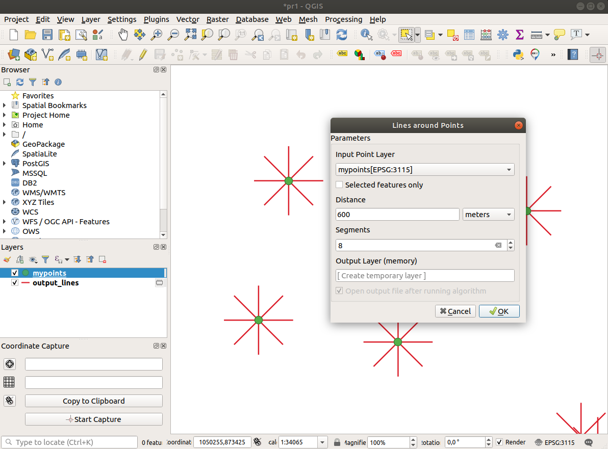
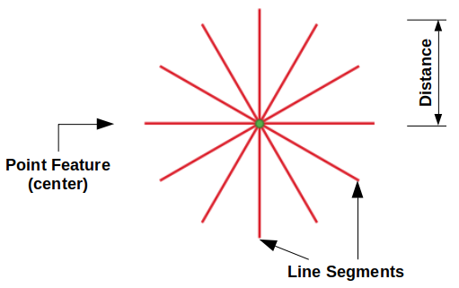
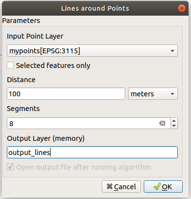

# Lines around Points - QGIS Plugin

This plugin creates lines around to a point layer to a given a certain distance and a number of segments.

## Screenshot 

With this plugin you can:

- Create a new line layer. Each line is created around a point structure within the circular footprint (circle of radius given ). 

- In a very simple way a GUI  allows to indicate the required parameters.

## Requirements

- QGIS 3.x

## Download

The plugin can be downloaded [lines_around_point.zip] (lines_around_point.zip) and installed in QGIS from the plugin manager -> option (Install from ZIP)
